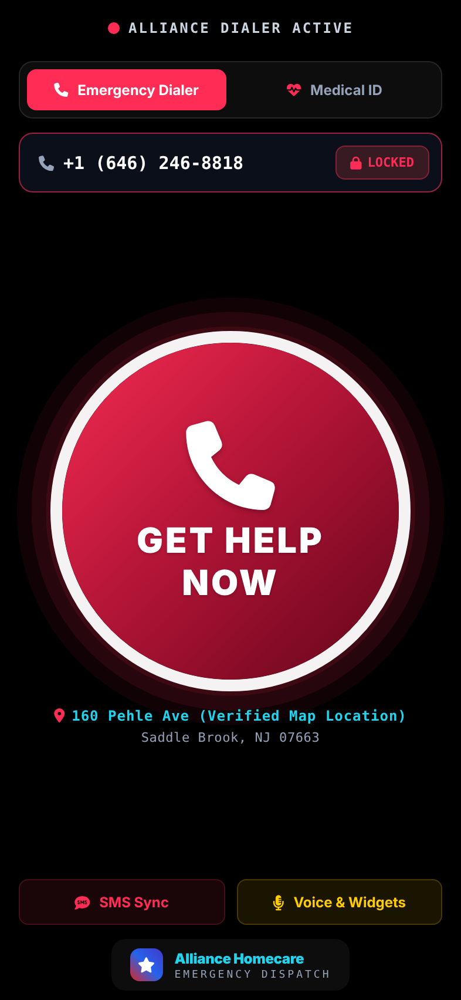
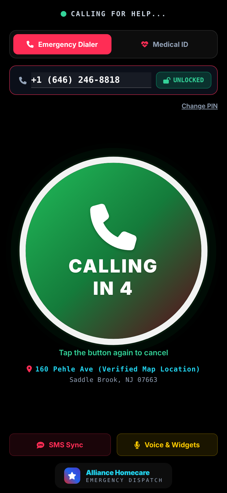
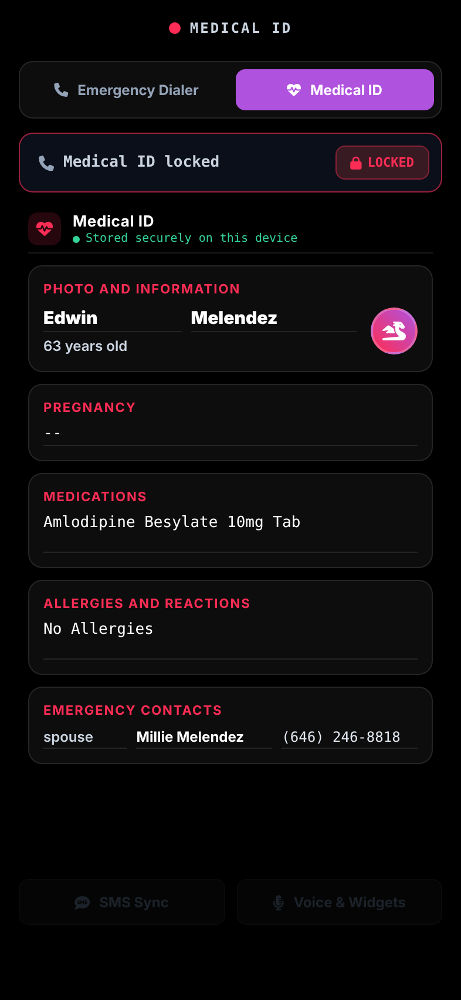
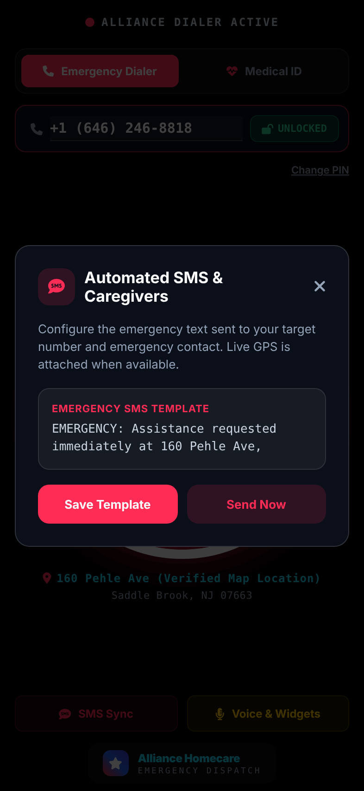

# Alliance Homecare — Emergency Call Button

Native iOS and Android version of the Alliance Homecare high-contrast emergency
dialer, built with [Expo](https://expo.dev) (SDK 57, React Native 0.86). One
codebase builds for both the **Apple App Store** and **Google Play**.

| Dialer | Calling | Medical ID | SMS |
| --- | --- | --- | --- |
|  |  |  |  |

## What it does

- **GET HELP NOW** button with a breathing glow. Tap it and it turns green,
  vibrates, says "Calling for help..." aloud, counts down 5 seconds, then
  opens the phone dialer with the target number. Tap again during the
  countdown to cancel.
- **Target number** is locked behind a 4-digit PIN (default `9999`). The PIN
  is kept in the iOS Keychain / Android Keystore and can be changed after
  unlocking.
- **Medical ID** tab: name, age, pregnancy, medications, allergies and an
  emergency contact. You can edit it after unlocking, and it's saved on
  the device.
- **SMS Sync**: an editable emergency text template. **Send Now** opens the
  messaging app with the text addressed to the target number and emergency
  contact, with a live GPS link added.
- **Siri / Voice & Widgets**: instructions for hands-free launch on each
  platform.
- **Inactivity reset**: after 5 seconds without a touch, the app goes back to
  the dialer and closes any open panel.
- Verified map location (160 Pehle Ave, Saddle Brook, NJ) opens in Maps.

Default data, the countdown length and the inactivity timeout live in
[`src/config.ts`](src/config.ts). Colors and fonts live in
[`src/theme.ts`](src/theme.ts).

## Project layout

```
App.tsx                         screen layout, state, call/SMS/PIN logic
src/components/EmergencyButton  animated call button
src/components/HealthIdView     Medical ID cards
src/components/Sheet            modal panels (SMS, voice, PIN)
src/config.ts                   seed data + timing constants
src/storage.ts                  on-device storage (AsyncStorage + SecureStore)
assets/                         app icon, adaptive icon layers, splash
app.json                        store identifiers, permissions, plugins
eas.json                        cloud build + submit profiles
```

## Run it locally

```bash
npm install
npx expo start          # scan the QR code with Expo Go (iOS / Android)
```

## Build and publish to the stores

You don't need a Mac or Android Studio. EAS builds in the cloud.

1. Create a free Expo account, then run `npx eas-cli@latest login`.
2. Change the identifiers in `app.json` if you need to. Both are currently
   `com.alliancehomecare.emergency`, and each store requires the ID to be
   unique to your developer account.
3. Run `npx eas-cli@latest init` once to link the project.
4. Test build (installable APK or internal iOS build):
   ```bash
   npx eas-cli@latest build --profile preview --platform all
   ```
5. Store build and submission:
   ```bash
   npx eas-cli@latest build --profile production --platform all
   npx eas-cli@latest submit --platform ios       # App Store Connect / TestFlight
   npx eas-cli@latest submit --platform android   # Google Play (internal track)
   ```

Accounts you need: an **Apple Developer Program** membership ($99/yr) and a
**Google Play Console** account ($25 one-time).

## Store review notes

- **Calls are user-confirmed.** iOS always shows a "Call?" confirmation for
  `tel:` links. On Android the dialer opens with the number filled in. Both
  stores expect this. Calling silently in the background would need extra
  native permissions that review is likely to question.
- **SMS cannot be sent automatically** on either platform. The app opens a
  pre-filled message and the user taps Send.
- **Health data:** the web prototype said "Apple Health ID Auto-Sync". This
  app stores its own Medical ID and does **not** read HealthKit, so the label
  is "Medical ID". Apple rejects apps that claim HealthKit integration they
  don't have. Reading HealthKit / Health Connect could be added later with a
  native module.
- **Privacy:** all data stays on the device and nothing is sent to a server.
  Both stores still require a privacy-policy URL and a data-safety /
  privacy-nutrition form. Declare *Location (used for app functionality, not
  linked to identity, not shared)* and *Health info (stored on device only)*.
- **Emergency disclaimer:** add a line to the store description saying the
  app is not a replacement for 911.
